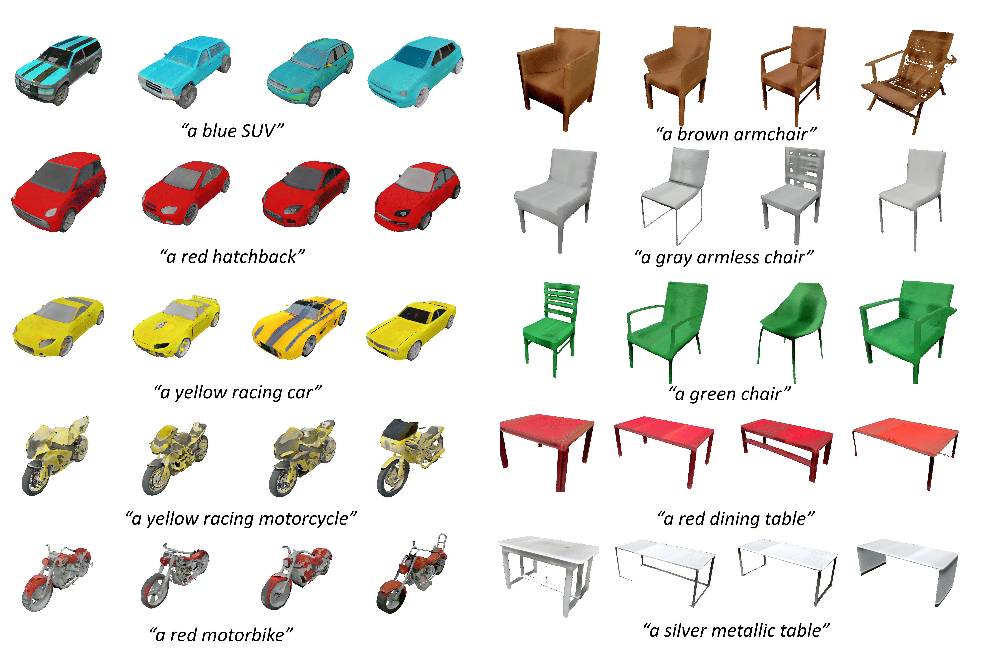

## TAPS3D: Text-Guided 3D Textured Shape Generation from Pseudo Supervision<br><sub>Official PyTorch implementation </sub>


Abstract: *In this paper, we investigate an open research task of generating controllable 3D textured shapes from the given textual descriptions. Previous works either require ground truth caption labeling or extensive optimization time. To resolve these issues, we present a novel framework, TAPS3D, to train a text-guided 3D shape generator with pseudo captions. Specifically, based on rendered 2D images, we retrieve relevant words from the CLIP vocabulary and construct pseudo captions using templates. Our constructed captions give high-level semantic supervision for generated 3D shapes. Further, in order to produce fine-grained textures and increase geometry diversity, we propose to adopt low-level image regularization to enable fake-rendered images to align with the real ones.   
During the inference phase, our proposed model can generate 3D textured shapes from the given text without any additional optimization. We conduct extensive experiments to analyze each of our proposed components and show the efficacy of our framework in generating high-fidelity 3D textured and text-relevant shapes. *

"A red car":

"A brown chair":


## Requirements

* We recommend Linux for performance and compatibility reasons.
* 8 high-end NVIDIA GPUs. We have done all testing and development using V100 or A100
  GPUs.
* 64-bit Python 3.8 and PyTorch 1.9.0. See https://pytorch.org for PyTorch install
  instructions.
* CUDA toolkit 11.1 or later.  (Why is a separate CUDA toolkit installation required? We
  use the custom CUDA extensions from the StyleGAN3 repo. Please
  see [Troubleshooting](https://github.com/NVlabs/stylegan3/blob/main/docs/troubleshooting.md#why-is-cuda-toolkit-installation-necessary))
  .
* CLIP from [official repo](https://github.com/openai/CLIP)
* We also recommend to install Nvdiffrast following instructions
  from [official repo](https://github.com/NVlabs/nvdiffrast), and
  install [Kaolin](https://github.com/NVIDIAGameWorks/kaolin).
* We provide a [script](./install_taps3d.sh) to install packages.


## Preparation

#### Environment
```bash
bash install_taps3d.sh
```

#### Dataset

Please download the ShapeNetCore.v1 dataset from this [link](https://shapenet.org/).

#### Render images

Please follow the instructions from [GET3D](https://github.com/nv-tlabs/GET3D/tree/master/render_shapenet_data) to render Shapenet dataset.

#### Generate pseudo captions
Run pseudo caption generation script

```bash
bash generate_captions.sh IMG_ROOT 
```

## Train the model

#### Clone the code and necessary files:

```bash
cd YOUR_CODE_PARH
git clone git@github.com:nv-tlabs/GET3D.git
cd GET3D; mkdir cache; cd cache
wget https://api.ngc.nvidia.com/v2/models/nvidia/research/stylegan3/versions/1/files/metrics/inception-2015-12-05.pkl
```

#### Train the model

```bash
cd YOUR_CODE_PATH 
export PYTHONPATH=$PWD:$PYTHONPATH
```

Download the unconditional pretrained model from [GET3D](https://drive.google.com/drive/folders/1oJ-FmyVYjIwBZKDAQ4N1EEcE9dJjumdW?usp=sharing).


```bash
python train.py --outdir OUTPUT --num_gpus NUM_GPUS --batch_size BATCH_SIZE --batch_gpu BATCH_GPU --network PRETRAINED_MODEL --seed 1 --snap 1000 --lr LR --lambda_global 1 --lambda_direction 0 --lambda_imgcos 1 --image_root IMG_ROOT --gen_class CLASS --mask_weight 0.05 --workers 8 --tex_weight 4 --geo_weight 0.02
```

## Inference

### Inference on a pretrained model for visualization

- Inference could operate on a single GPU with 16 GB memory.

Generate samples:
```bash
python generate_samples.py --network TRAINED_MODEL --class_id CLASS --seed 0 --outdir save_inference_results/ --text INPUT_TEXT
```

- To generate mesh with textures, add one option to the inference
  command: `--inference_to_generate_textured_mesh 1`


## Broader Information

TAPS3D builds upon several previous works:

- [GET3D: A Generative Model of High Quality 3D Textured Shapes Learned from Images (NeurIPS 2022)](https://nv-tlabs.github.io/GET3D/)
- [Learning Deformable Tetrahedral Meshes for 3D Reconstruction (NeurIPS 2020)](https://nv-tlabs.github.io/DefTet/)
- [Deep Marching Tetrahedra: a Hybrid Representation for High-Resolution 3D Shape Synthesis (NeurIPS 2021)](https://nv-tlabs.github.io/DMTet/)
- [Extracting Triangular 3D Models, Materials, and Lighting From Images (CVPR 2022)](https://nvlabs.github.io/nvdiffrec/)
- [DIB-R++: Learning to Predict Lighting and Material with a Hybrid Differentiable Renderer (NeurIPS 2021)](https://nv-tlabs.github.io/DIBRPlus/)
- [Nvdiffrast – Modular Primitives for High-Performance Differentiable Rendering (SIGRAPH Asia 2020)](https://nvlabs.github.io/nvdiffrast/)

## Citation

```latex
@inproceedings{wei2023taps3d,
  title={TAPS3D: Text-Guided 3D Textured Shape Generation from Pseudo Supervision},
  author={Wei, Jiacheng and Wang, Hao and Feng, Jiashi and Lin, Guosheng and Yap, Kim-Hui},
  booktitle={Proceedings of the IEEE/CVF Conference on Computer Vision and Pattern Recognition},
  pages={16805--16815},
  year={2023}
}
```